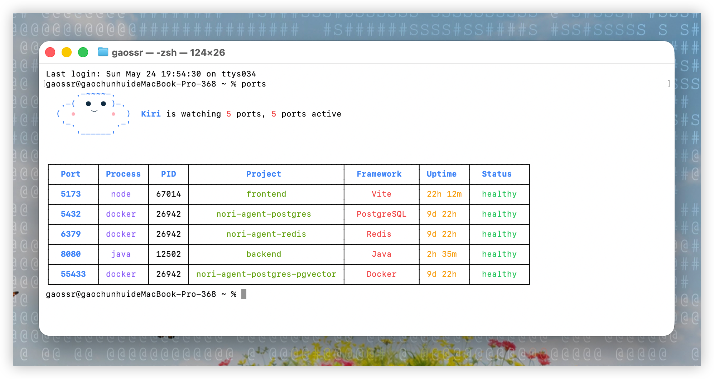
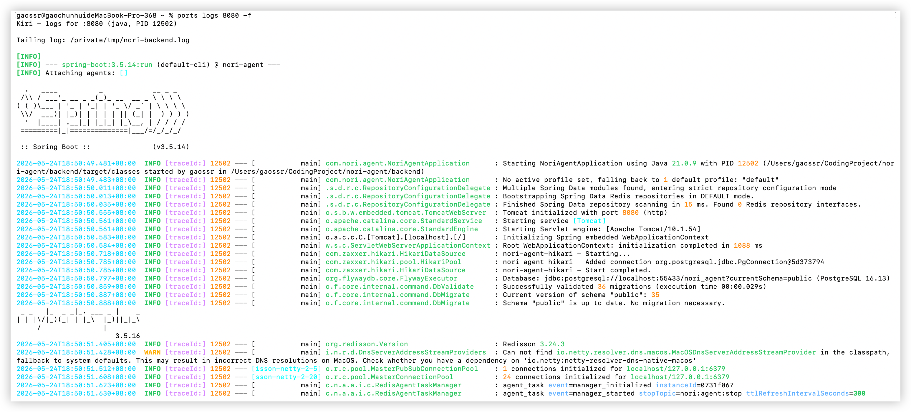

<h4 align="right"><a href="./README.md">English</a> | <strong><a href="./README_CN.md">简体中文</a></strong></h4>

<p>
  <picture>
    <source media="(prefers-color-scheme: dark)" srcset="assets/kiri-logo.png">
    <source media="(prefers-color-scheme: light)" srcset="assets/kiri-logo.png">
    
  </picture>
</p>

<br />
<br />

<p align="center">
  <a href="https://github.com/GaoSSR/kiri">
    <picture>
      <source media="(prefers-color-scheme: dark)" srcset="assets/kiri-wordmark-dark.svg">
      <source media="(prefers-color-scheme: light)" srcset="assets/kiri-wordmark-light.svg">
      
    </picture>
  </a>
</p>

<br clear="right" />

<h3 align="center"><nobr>由 Rust 语言所驱动的管理本地开发端口的高性能 CLI</nobr></h3>

---

<p align="center">
  
  
  
  
</p>

## Kiri 简介

Kiri 是一款由 Rust 语言所驱动的管理本地开发端口的高性能 CLI，它帮助你快速看清本地开发启动了哪些服务、占用了哪些端口，并在需要时处理端口背后的进程。

<p align="center">
  
</p>

<p align="center">
  
</p>

## 认识 Kiri

默认 `ports` 终端视图会先显示一个紧凑的 Kiri 伙伴，然后再展示端口表：

```text
      .-~~~~-.
   .-(  ●  ● )-.
  (  •   ⌣   •  )  Kiri is watching 5 ports, 5 ports active
   '-.        .-'
      '------'
```

## 核心用法

- **快速查看本地开发端口：** `ports`
- **快速 Kill 掉端口所对应的进程 / PID：** `ports kill <port>`
- **持续监听端口所对应进程的日志：** `ports logs <port|pid> -f`
- **查看所有端口：** `ports --all`

## 安装

Kiri 当前已经发布 macOS、Linux x64、Windows x64 预编译 release artifacts。可以使用 npm、Homebrew 或 GitHub Release 安装脚本：

```bash
# npm
npm install -g @gaossr/kiri

# Homebrew
brew install gaossr/tap/kiri

# macOS / Linux 安装脚本
curl -fsSL https://raw.githubusercontent.com/GaoSSR/kiri/main/scripts/install.sh | bash
```

Windows 用户可以使用 PowerShell 安装：

```powershell
irm https://raw.githubusercontent.com/GaoSSR/kiri/main/scripts/install.ps1 | iex
```

Homebrew 只覆盖 macOS。npm 和安装脚本使用预编译原生二进制，不会在用户机器上本地编译 Rust。

## 命令

```bash
ports                       # 快速查看本地开发端口
ports --all                 # 展示所有监听端口
ports <port>                # 查看单个端口详情
ports ps                    # 展示开发相关运行进程
ports ps --all              # 展示所有进程
ports logs <port|pid>          # 查看最近日志后退出
ports logs <port|pid> -f       # 持续监听端口所对应进程的日志
ports logs 3000 --lines 10     # 只看最后 10 行后退出
ports logs 3000 -f --lines 10  # 先看最后 10 行并继续监听
ports logs 3000 --err          # 只看 stderr
ports clean                 # 清理孤儿或僵尸开发进程前先询问
ports watch                 # 监听端口启动和停止事件
ports kill 3000             # 快速 Kill 掉端口所对应的进程 / PID
ports kill 3000-3010        # 终止一个端口范围内的监听进程
ports kill --force 3000     # 使用 SIGKILL 而不是 SIGTERM
```

## 平台支持

| 平台 | 状态 |
| --- | --- |
| macOS arm64/x64 | 已支持 |
| Linux x64 | 已支持 |
| Windows x64 | 已支持 |
| Linux arm64 / Windows arm64 | 已规划 |

在 macOS 上，Kiri 使用 `lsof`、`ps`、`tail`、macOS `log` 命令，并在 Docker 可用时读取容器端口映射。Linux 使用 `ss`、`ps`、`/proc` 和可选 Docker 元数据。Windows 使用 PowerShell/CIM 和 `Get-NetTCPConnection`。Docker 是可选项；如果 Docker 不可用或没有运行容器，Kiri 会继续正常工作。

`ports logs` 会为常见开发日志格式添加 ANSI 颜色，包括 Java、Python、Go、Node.js、logfmt 和 JSON 日志。

## 开发

维护者和贡献者可以从源码运行检查：

```bash
cargo fmt
cargo test
cargo run --bin ports
cargo run --bin ports -- --all
cargo run --bin ports -- ps
```

## 项目资料

- [更新日志](./CHANGELOG.md)
- [贡献指南](./CONTRIBUTING.md)
- [安全策略](./SECURITY.md)
